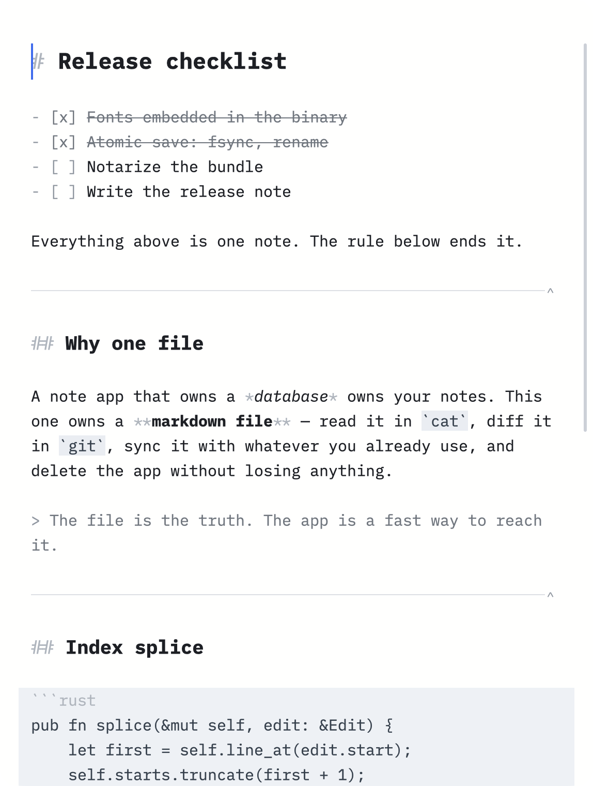

# GravityNote

**One markdown file, every note, one keystroke away.** A shortcut-driven note
app for macOS, built in Rust on [GPUI](https://gpui.rs) — the same GPU UI stack
Zed uses.

GravityNote is an implementation of the single-note workflow described by
Andrej Karpathy in [The append-and-review note](https://karpathy.bearblog.dev/the-append-and-review-note/).
Keep everything in one text document, add new thoughts at the top, and periodically
review older entries, bringing the ones that still matter back to the top.
GravityNote puts that idea into a native Mac app: one Markdown file, quick capture,
full-text search, and a shortcut or `^` button to bring an entry back to the top.

[](https://github.com/1234igor/gravitynote/actions/workflows/ci.yml)
[](https://www.rust-lang.org)
[](https://gpui.rs)
[](https://www.apple.com/macos/)
[](LICENSE)



⌃A from any app brings it up; ⌃A puts it away. One window, paper-white, no
chrome. A `---` thematic break separates one note from the next — nothing else
does, so blank lines are yours to space a note however you like. Each separator
draws a hairline with a small `^` on the right that pulls the note beneath it
back to the top.

Everything is stored as a single `note.md` you can read, edit and sync yourself.
The file is the truth; the app is just a fast way to reach it.

## Features

- **One window**, paper-white, text-only chrome
- **Markdown syntax colouring** — headings, emphasis, code, links, lists, tasks,
  quotes, fenced blocks
- **Find** across the whole note, incremental, at the top of the window; ⌘F
  takes the selected word as the query
- **No chrome** — the window is the note; even the close / minimise / zoom
  buttons stay hidden until you reach for them
- **Lists that behave** — Enter carries the bullet, task box or indentation on;
  ⇥ nests; ⌘⇧T makes a task; ⌘⏎ ticks it
- **Notes separated by `---`**; a note is as many lines, and as many blank
  lines, as you like
- **Soft wrap** — long lines flow instead of running off the window
- **⌃A from anywhere** shows or hides the app; it also lives in the menu bar
- **Autosaves** atomically, and **backs itself up hourly** (48 kept)
- **Opens at login** if you ask it to, from the GravityNote menu

## Shortcuts

| Shortcut | Action |
|----------|--------|
| ⌃A | Show / hide GravityNote from any app |
| ⌘N | New note at the top |
| ⌘⇧↑ | Bring the note you're in to the top |
| ⌘⌃↑ | Move that note up one place |
| Click `^` on a rule | Bring the note below it to the top |
| ⌘F | Find in the note (seeded with the selection); ⏎ / ⇧⏎ or ↓ / ↑ to cycle, Esc or ✕ to close |
| ⌘+ / ⌘− / ⌘0 | Bigger / smaller / default text size |
| ⌘S | Back up now |
| ⌘Z / ⌘⇧Z | Undo / redo |
| ⌘↑ / ⌘↓ | Document start / end |
| ⌘← / ⌘→ | Start / end of the visual row |
| ⏎ in a list | Carry the list on; again on an empty item to leave it |
| ⇥ / ⇧⇥ | Indent / outdent the line, or every line you have selected |
| ⌘⇧T | Make it a task — or take the box off again |
| ⌘⏎ | Complete a task, or un-complete it |
| ⌥← / ⌥→ | Word left / right |
| ⌥⌫ / ⌘⌫ | Delete word / delete to line start |
| Double-click | Select word |
| Triple-click | Select paragraph |
| ⌘A / ⌘C / ⌘V / ⌘X | Select all / copy / paste / cut |
| ⌘Q | Quit (saves first) |

## Where your note lives

```
~/Library/Application Support/gravitynote-gpui/
├── note.md                       # the note
├── settings.txt                  # text size
└── backups/note-YYYY-MM-DD_HH-MM-SS.md
```

Saves are atomic — written to a temp file in the same directory, fsynced, then
renamed — so a crash mid-write cannot truncate your note. If the note fails to
load, saving is disabled until you make an edit, so a read error can never
overwrite the file.

## Performance

The app is built to stay fast at **twenty years of daily note-taking**.
`tests/huge_note.rs` measures against a generated corpus of **9.22 MB /
213,687 lines / 36,500 notes**:

| Operation | Measured (release) |
|-----------|--------------------|
| Typing one character: insert + index splice | **0.102 ms** |
| The same with the index rebuilt instead — the bound the splice avoids | 5.5 ms |
| `LineIndex` built from scratch over 9.22 MB | 7.3 ms |
| `line_at` lookup | 0.021 µs |
| Caret motion (`prev`/`next_grapheme`) | 0.021 µs |
| UTF-16 conversion (the macOS IME asks per keystroke) | 0.18 µs / 0.29 µs |
| Highlighting one screenful (60 lines) | 0.009 ms |
| Highlighting the whole document | 23.7 ms — **2500x** one screenful |
| `blocks()` over the whole document | 15.9 ms — a user action, never a frame |

Every row is printed by `tests/huge_note.rs`; the table is transcribed from a
run, not from memory.

Idle CPU is under 1%, and an unfocused window does no work at all: the caret
draws nothing and its clock drops to one wake-up per cycle. Even focused, the
caret only repaints while it is actually fading — `caret::phase` returns how
long its answer holds, so the still parts of the rhythm are slept through rather
than polled.

Three rules keep it there:

1. **Nothing in the frame path is O(document).** Rows are virtualized, so only
   the visible lines are shaped and highlighted. That last table row is why:
   whole-document highlighting is never on the render path.
2. **Offset math goes through a `LineIndex`** — O(log n) line lookups and UTF-16
   conversion, instead of walking the buffer.
3. **Derived state is patched, not rebuilt.** An edit splices the line index,
   the fenced-code map, and the list's cached row heights, so one keystroke
   touches one row. Both splices are covered by differential tests that drive
   thousands of random edits and assert the patched structure is identical to
   one rebuilt from scratch.

```bash
cargo test --release --test huge_note -- --nocapture   # prints the table above
cargo run --release --example gen_corpus -- /tmp/big.md
```

## Tech stack

| Layer | Choice |
|-------|--------|
| Language | Rust |
| UI | [gpui](https://gpui.rs) 0.2.x (Apache-2.0), vendored — see below |
| Rendering | Metal, via GPUI |
| Menu bar + hotkey | `objc2` for `NSStatusItem`; Carbon `RegisterEventHotKey` for ⌃A |

Carbon's hotkey API is used deliberately: unlike an `NSEvent` global monitor it
needs no Accessibility permission. If another app already owns ⌃A, registration
fails softly and ⌃A still works while GravityNote is focused.

`vendor/gpui` is a fork of `gpui` 0.2.2 that adds a Liquid Glass window
background; it is vendored so this repository builds on its own. The changes are
listed in [`vendor/gpui/MODIFICATIONS.md`](vendor/gpui/MODIFICATIONS.md). **No
Zed editor source is present** — `gpui` is a separate Apache-2.0 crate that Zed
publishes, and none of the GPL-licensed editor is copied, vendored or linked.

The crate is split into a library and a binary so the document layer is testable
and benchmarkable without a window:

| Module | Role |
|--------|------|
| `note` | The document: text buffer, lines, `---`-separated blocks |
| `index` | O(log n) line / UTF-16 index, with incremental `splice` |
| `markdown` | Per-line highlighting into contiguous styled spans |
| `find` | Case-insensitive search over the whole note |
| `settings` | The one persisted preference: text size |
| `fences` | Which lines sit inside a ``` block, patched incrementally |
| `history` | Undo/redo over spans, typing coalesced into groups |
| `selection` | Word / paragraph ranges for multi-click and word motion |
| `persist` | Atomic autosave and hourly rolling backups |
| `corpus` | Deterministic note generator for the performance tests |
| `theme` | Palette and the markdown-style → text-attribute mapping |
| `caret` | The caret's fade rhythm, and when it next needs drawing |
| `platform` | macOS menu-bar item, global hotkey, traffic-light visibility |
| `login_item` | Whether the app opens at login, via `SMAppService` |
| `rows` | Visual-row caret motion, wrap affinity, hit-testing |

## Font

UI text uses **[Lilex](https://github.com/mishamyrt/Lilex)** (IBM Plex
Mono–based, with ligatures). Regular, SemiBold, Bold, Italic and BoldItalic are
embedded, so markdown emphasis renders in real faces rather than synthesised
ones.

## Roadmap

[ROADMAP.md](ROADMAP.md) is the full feature table: what is done, what is
planned, and what was considered and turned down — with the reason, which is the
useful part.

## Licence

[MIT](LICENSE). Use it in commercial work, including paid App Store apps,
without asking. See [THIRD-PARTY.md](THIRD-PARTY.md) for what is bundled and
under what terms — nothing here is copyleft.

The licence covers the code. The name **GravityNote** and the app icon are not
part of the grant — fork the app freely, but ship it under your own name and
your own icon so nobody is confused about which one they installed.
